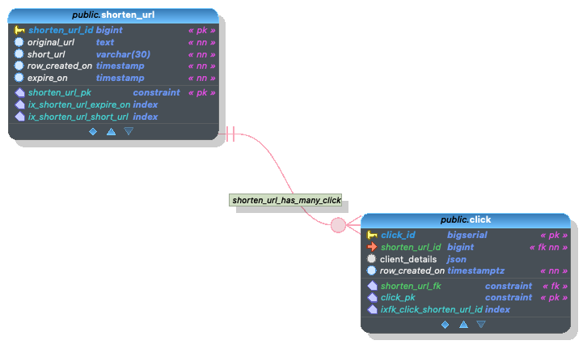

# URL-shorten

Shorten the long URL for SMS.


## Features

* Create Short URL for SMS
* Track how many number of times the link is clicked & when the link was accessed
* Client Click Track includes
  * IP Address
  * Browser details
  * ...client header information

## Requirements:

* Database - PostgreSQL preferable. [DDL](./docs/url_shorten.sql)
* JRE 17 or above
* Host the application where the short URL domain is directs (OR) `Nginx` for reverse proxy



## Generate the short URL Flow

1. Insert's the original URL to the database and gets the primary key
2. Generate short path/URL using primary key 
3. Store the short URL to database and return

Input

``` curl
curl --location 'localhost:9054' \
--header 'Content-Type: application/json' \
--data '{
  "originalUrl": "https://thirumal.org/cast_vote/a015a1fd-f649-4aa4-ae87-a7855af9083d/16663ad0-cbb8-46ed-ad0a-22958aef62d0",
  "shortUrlHostAndProtocol": "http://ln.org",
  "expireOn": "2023-02-15T15:44:45.320Z"
}'
```


output:

```
{
    "shortenUrlId": 1,
    "originalUrl": "https://thirumal.org/cast_vote/a015a1fd-f649-4aa4-ae87-a7855af9083d/16663ad0-cbb8-46ed-ad0a-22958aef62d0",
    "shortUrlHostAndProtocol": "http://ln.org",
    "shortUrl": "http://ln.org/a",
    "rowCreatedOn": null,
    "expireOn": "2023-02-15T15:44:45.32"
}
```

## Redirect to Original URL Flow

* Make sure the application is running on the short URL domain & nginx/any other proxy redirect to this application
* Short to primary key 
* Get original URL from the database
* Redirects to the original URL with HTTP status code 302

Input:

```curl
curl --location 'http://localhost:9054/d' \
--data ''
```

Output:

```
---Redirect to PAGE
```

